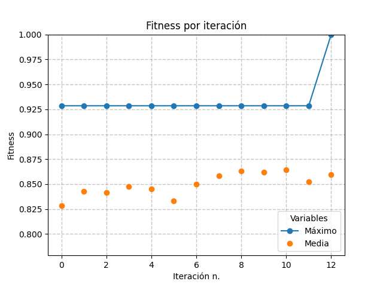
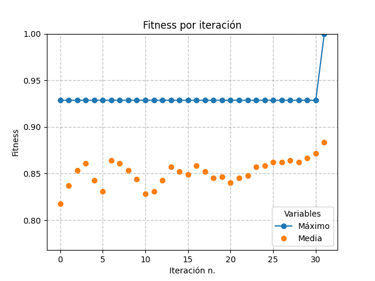
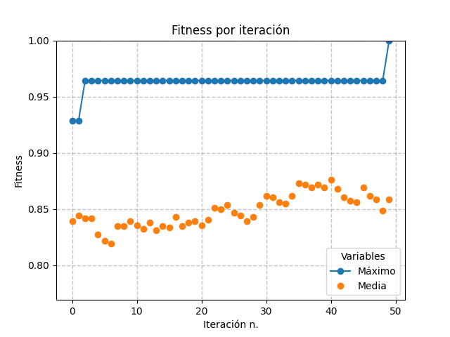

# Geneticos-y-8-Reinas
Primer proyecto de tecnicas de IA. 

## 1. Introducción. 

## 2. Materiales y métodos.
- ### 💻 Requerimientos 
- 🐍 Python: 3.7
- 📚 Bibliotecas usadadas pueden consultarse [aqui](requirements.txt).  
  En especifico se usaron las siguientes funciones de las librerias instaladas para resolver el problema:
    * `np.random.uniform()`: Para generar un número aleatorio de una distribución uniforme (selección de padres)
    * `np.random.choice()`:  Para generar permutaciones aleatorias (inicialización); así mismo para generar dos números aleatorios no repetidos (inversión)

  Podra ver que en los requerimientos pide matplotlib, pero este solo fue usado para realizar las gráficas.
- ### 🧮 Tabla de datos:

  
| Función | Asignada |
|----------|---------|
| **Inicialización** | Aleatoria |
| **Selección de padres** | Ruleta de aptitud |
| **Cruza** | Ciclica |
| **Mutación** | Inversión |
| **Remplazo** | Generacional |

### Descripcción de los métodos de la tabla

A continuación damos una descripción de las funciones asiganadas para el desarrrollo de la resolución de nuestro problema.

*  **_Aleatoria._**
  La función aleatoria se encuentra en [inicialización](https://github.com/Qntmth-uv/Geneticos-y-8-Reinas/blob/main/inicializacion.py). Esta se compone principalmente la función `initab()`.
  La función `iniTab()` inicializa una permutación aleatoria de la lista $\left[ 0, 1 ,2, 3, 4, 5, 6, 7 \right]$, digamos $s$.
  La función `createPopulation` tiene por entrada un número entero positivo $n$ y devuelve una lista de tamaño $n$ con $n$ `iniTab()`.
  La función `diagAtack` tiene por entrada una permutación $s$, y calcula usando proyecciones si existe un ataque con las otras reinas en las otras coordenadas.
  La función `fitness` tiene por entrada una permutación $s$ y evalua que tan bueno es ese tablero de ajedrez. Esto usando por formula $1$-diagAttack/28.

  
* **_Selección de padres y remplazo._**
  La función _ruleta de aptitut_ se encuentra en el archivo [selección de padres](https://github.com/Qntmth-uv/Geneticos-y-8-Reinas/blob/main/remplazo_y_seleccion.py). La ruleta de aptitud es una función que dado un $\lambda$ y una lista de listas $\gamma$, se calculan los fitnes de cada uno de los elementos de $\gamma$, se normalizan éstos valores usando el máximo fitness encontrado. Posteirormente con los fintess normalizados cálculamos la probabilidad de que sea elegida una lista. Una vez calculado la probabilidad de cada lista, calculamos la probablidad acumulada. Posteriormente se generan $\lambda$ valores $n_r$, con $n_r\in U(0,1)$, donde $U$ es la distribución estandar del intervalo $[0,1]$ y $r\in \lbrace 0,..,\lambda \rbrace$. Posteriormente busca la lista que está más cerca por debajo del valor $n_r$ con respecto a la probabilidad acumulada de la lista. Se guardan los indices que satisfacen lo anterior.
  
  La función `selectionParentsRuleta` es nuestra función de ruleta de aptitud. Esta tiene por entradas:  
  - `población`: Listas de listas, nuestra población actual.  
  - `pick`: Un número entero positivo, nuestro numero de ganadores en la ruleta de aptitud.  
  - `remplace`: Un valor booleano, si deseadomos en la selección no se repitan ganadores.
    - `False`: No permite que se repitan ganadores en el sorteo.
    - `True`: Permite que se repitan ganadores.

  Regresa una lista de listas, que contiene:
  - `ChoicenOnes`: Las listas que fueron elegidas en la ruleta.
  - `indexChoicen`: Los indices de las listas de _ChoicenOnes_ con respecto a la lista original dada.
  - `max(fitneSet)`: El máximo fitness en la lista de listas actual.
  - `fitneSet.index(max(fitneSet))`: Regresa el indice de la lista con el mejor fitness.

* **_Cruza._**
  La función _cruza_ se encuentra en archivo [Cruza](https://github.com/Qntmth-uv/Geneticos-y-8-Reinas/blob/main/Cruza.py). La cruza ciclica toma dos listas que son permutaciones del mismo tamaño. Posteriormente a través de un algoritmo para buscar valores en la otra lista, se puede construir otras dos listas que en general son distintas a las originales.

   Nuestra función que hace la cruza ciclica se llama `biSonSex`. Esta función depende de otras dos. En especifico el orden es `biSonSex\sexCyclic\cyclicV3`.
 
   Las entradas de la función `biSonSex` son:
   * `entity1`, `entity2`: Una lista que es una permutación.

   Mientras que sus salidas son:
   * `son1`, `son2`: Listas a las que se les aplicado `sexCyclic`.
   Si desea más información sobre el como funcionan las otras dos funciones puede leer la descripción de cada una de las funciones en el codigo.

* **_Mutacion._**
  La función _mutacion_ se encuentra en el archivo [mutación](https://github.com/Qntmth-uv/Geneticos-y-8-Reinas/blob/main/mutacion.py). La mutación toma una única lista que es una permutación, posteriormente se generan dos valores aleatorios entre el cero y el largo de la lista, no repetidos. Se ordenan ambos valores aleatorios para poder crear un intervalo. Los valores que se encuentran en ese intervalo de la lista dada, se invertirán. Puede suceder que la mutación no haga nada.

   Nuestra función que hace la mutación se llama `mutacionUniparental`. 
 
   Las entradas de la función es:
   * `individio`: Una lista (no requiere que sea necesariamente una permutación)

   Mientras que su salida es:
   * `mut`: Una lista a la que se le ha aplicado la inversión.

* **_Remplazo._**
    La función _remplazo_ se encuentra en el archivo [remplazo](https://github.com/Qntmth-uv/Geneticos-y-8-Reinas/blob/main/remplazo_y_seleccion.py). El remplazo generacional intercambia las listas que fueron cruzadas y mutadas sobre las listas que se usaron para cruzar y mutar. De esta forma la población siempre se mantiene constante y variable.

    Las entradas de la función `remplacementV2` tiene por entradas:
    * `population`: Listas de lista con las que se va a mutar.  
    * `indexChoicen`: Indices de las listas ganadoras en la ruleta de aptitud con repsecto a la lista `population`.
    
    Regresa una lista de listas, esta es:
    * `modiPop`: Lista de listas con listas que han sido cruzadas y mutadas que han remplazado a los elemento que se usaron para crearlas.

* **_Main_.**

  Se ha creado una función main que se encuentra en el archivo [main](https://github.com/Qntmth-uv/Geneticos-y-8-Reinas/blob/main/main.py). La función `main` junta todos los modulos anteriores para poder resolver el problema de las ocho reinas. La dependencia de esta función es la siguiente:
  `main\inicializacion\selección y remplazo\cruza y mutación`.
  Evidentemente para poder correr una función que use todos los modulos anteiores se requieren unas ciertas entradas. Estas son:
    * `población`: Listas de listas, nuestra población actual.
    * `iter_ Número`: de iteraciones que se harán el algoritmo.
    * `selectionNumbers`: Un número entero positivo, nuestro numero de ganadores en la ruleta de aptitud.  
    * `remplace`: Un valor booleano, si deseadomos en la selección no se repitan ganadores.
      * `False`: No permite que se repitan ganadores en el sorteo.
      * `True`: Permite que se repitan ganadores.

  Esta regresa:
    * `MaxFitPerIter`: El máximo fitness de la _población_ en cada iteración.
    * `ancientPop` La `polacion` original.
    - `NewPop`: La `población` final, está es la población que ha sido seleccionada, cruzada, mutada y remplazada.
    - `bestBoard`: El mejor tablero de `Newpop` con respecto al fitness.

### 🛄 Gráficas de convergencia.
En las siguientes cuatro imagenes se muestra el comportamiento de la solución al problema de las cuatro reinas. Se han generado de la siguiente manera. Se han creado poblaciónes de treinta individuos un número máximo de cincuenta iteraciones, se han graficado el máximo fitness de cada iteración y la media del fitness de cada iteración. Podra observar que no todas las graficas poseén las cincuenta iteraciones, ya que algunas convergen prontamente a una solución. Así que para ahorar memoria cortamos las iteraciones cuando posemos alguna solución. Así mismo recuerdese que nuestro fitness es de cero a uno, entre más cercano a cero es peor el tablero, mientras que el uno es un tablero que no tiene ataques.

## 3. Conclusiones
Durante la programación del algoritmo de éste problema se notó la necesidad de saber que quieres hacer antes de ponerte a escribir a lo loco. Además del clásico hecho 

